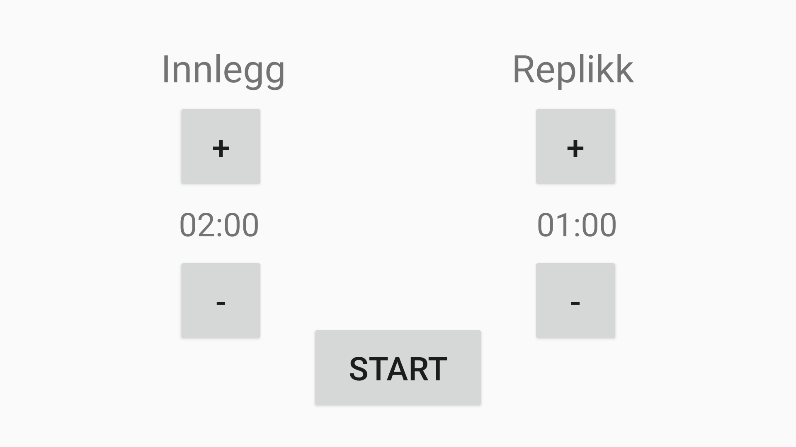
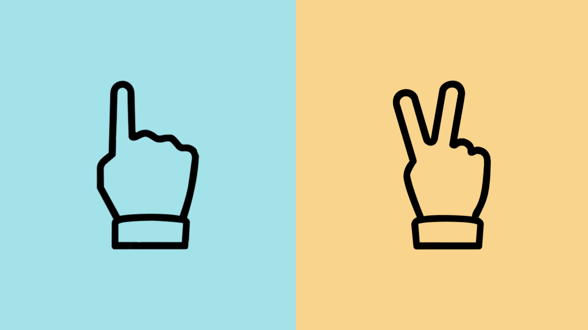
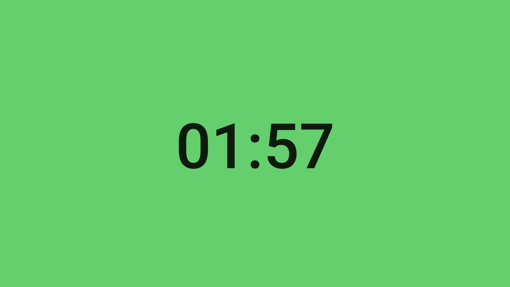
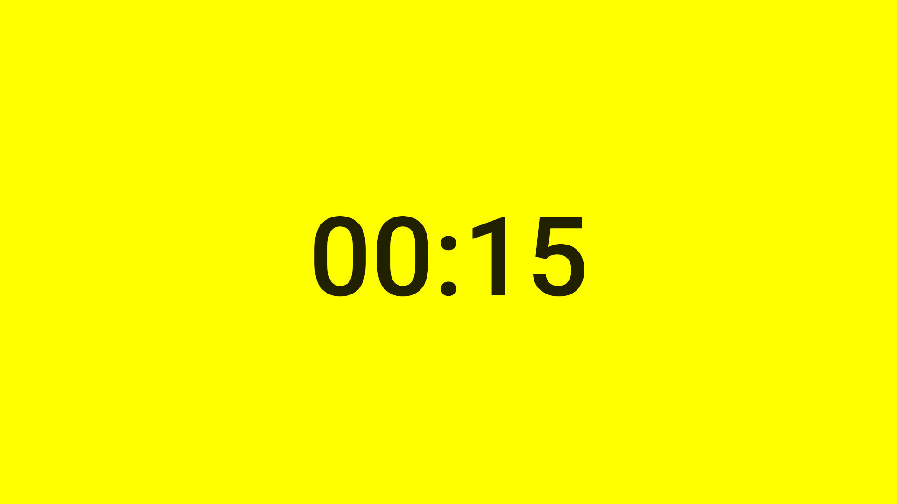
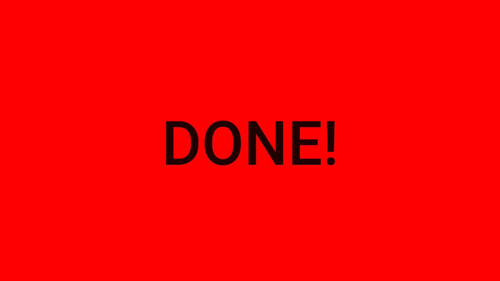

# Stopwatch for moderators

Simple app for ceeping track of how long people have spoken and how mutch time they have left.

Single press on screen to start timer, and stop timer and reset time.

Set time limit for speeches

Select type of speech

Countdown screen, press anywhere to stop and go back to previous screen

Screen changes color to yellow when there is 15 seconds left

Changes to red when time is up

